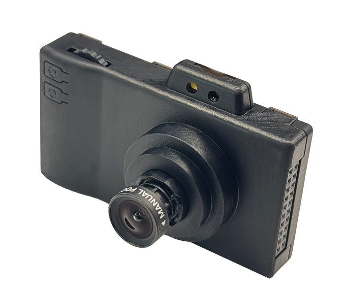
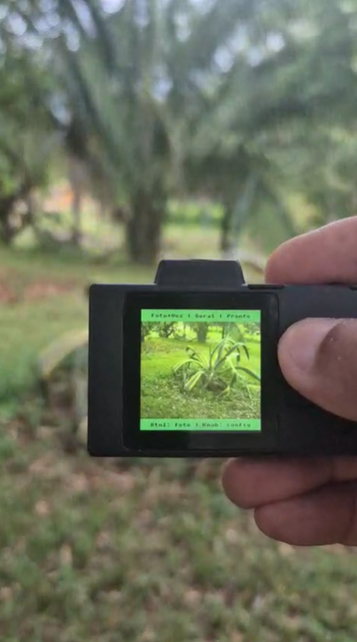
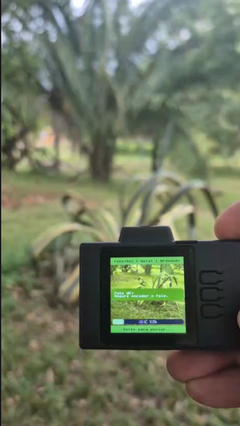
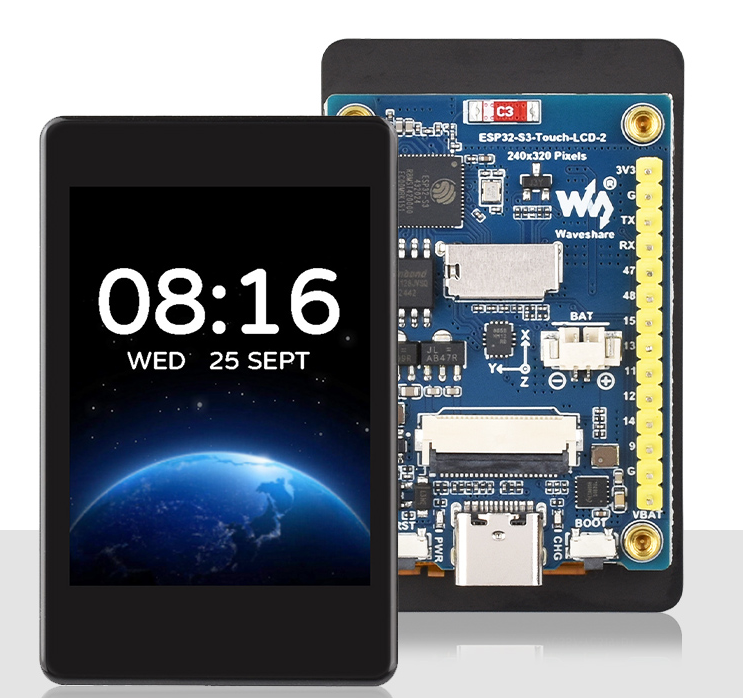
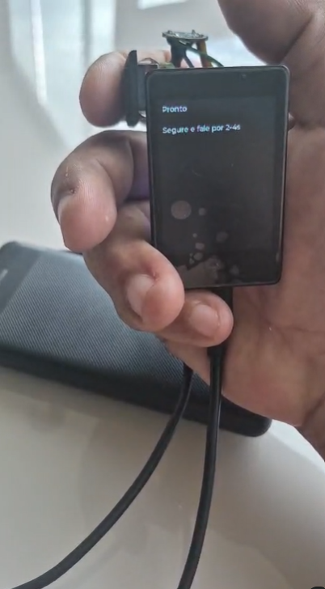
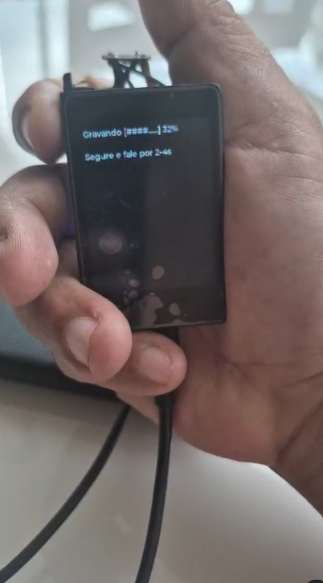
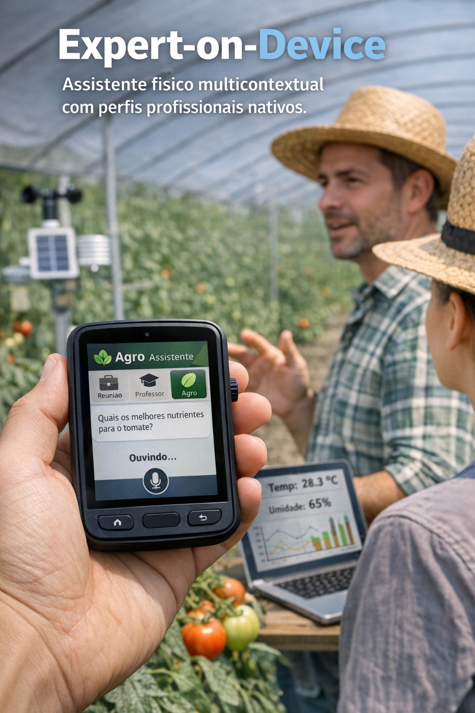

<div align="center">

# 🤖 ESP32 AI Assistant

### *Transforme um microcontrolador em um Assistente de IA com Visão por Câmera — Sem Nuvem Proprietária, Sem Assinatura Mensal, 100% Seu.*

[](LICENSE)
[](mailto:mrclnndrd@gmail.com)
[](https://github.com/espressif/esp-idf)
[-purple.svg)]()
[]()
[]()

---

> **"O menor assistente de IA com câmera do mundo — e você pode construir um hoje."**


<video src="https://github.com/user-attachments/assets/cf833a62-3809-4c02-ae4d-6812c46d103d" controls width="720">
  <a href="https://github.com/user-attachments/assets/cf833a62-3809-4c02-ae4d-6812c46d103d">▶ Ver demonstração em vídeo</a>
</video>


</div>

---

## 🚀 Plataforma "Expert-on-Device": Diferenciais Estratégicos com Impacto Econômico

Mais do que um simples "assistente de IA embarcado", esta solução é uma **plataforma de especialistas multimodais embarcados, configuráveis e soberanos para aplicações profissionais**. Ela eleva o valor percebido, facilita a verticalização por mercado e sustenta múltiplos modelos de monetização (hardware, licenciamento, perfis especialistas, integrações corporativas).

1. **LLM Agnóstico → Redução de Custos Operacionais**
   Permite uso de servidor próprio ou troca de modelo conforme preço/desempenho.
   *Impacto:* elimina dependência de fornecedores e reduz custo por inferência.

2. **Execução *Edge* + *On-Premise* → Privacidade e Conformidade**
   Processamento local com envio opcional ao servidor próprio.
   *Impacto:* viável para hospitais, indústria e agro com restrição e dados sensíveis.

3. **Perfis Especialistas Persistentes → Produto Verticalizável**
   Cada dispositivo pode atuar como especialista embarcado (agro, manutenção, ensino).
   *Impacto:* cria linhas de produto segmentadas com maior ticket médio (B2B).

4. **Hardware de Baixo Custo → Escala em Larga Quantidade**
   Base em ESP32 permite implantação massiva com baixo CAPEX (U$20 - U$33 a unidade).
   *Impacto:* viabiliza vendas em volume para grandes empresas e instituições.

5. **Multimodalidade Completa → Apoio Objetivo à Mão de Obra Especializada**
   Combina visão + voz + contexto técnico nativamente e em tempo real.
   *Impacto:* redução drástica de tempo de diagnóstico e suporte técnico.

6. **Configuração Dinâmica → Implantação Rápida em Campo**
   Perfis e *endpoints* configuráveis via Portal Integrado, sem recompilação de código.
   *Impacto:* menor custo logístico de suporte e manutenção para os clientes.

7. **Persistência Local de Logs no SD → Auditoria e Pesquisa**
   Armazenamento automático das interações para análise posterior (áudios, *logs* e fotos).
   *Impacto:* valor essencial para universidades, P&D e ambientes regulados.

8. **Firmware Modular → Licenciamento Tecnológico**
   Arquitetura reutilizável em múltiplos dispositivos e parceiros OEM.
   *Impacto:* abre modelo escalável de receita por licenciamento de *firmware*.

9. **Soberania de Dados → Diferencial Competitivo Institucional**
   Operação totalmente contida localmente quando em rede corporativa interna.
   *Impacto:* forte apelo comercial para órgãos públicos, indústria e centros de pesquisa.

10. **Plataforma “Expert-on-Device” → Base para Ecossistema**
    Permite vender e atualizar perfis especialistas como módulos ou serviços.
    *Impacto:* fomenta a receita recorrente muito além da venda de hardware.

---

## 🎯 Comparativo com Soluções de Mercado

| | ✅ ESP32 AI Assistant | ❌ Soluções Típicas |
|---|---|---|
| 💰 Custo do hardware | **U$33 (P4-EYE no DigiKey) ou U$20 (S3)** | U$200 a U$2.000+ |
| 🌐 Servidor próprio | **Não precisa** | Obrigatório |
| 🤖 Modelo de IA | **Agnóstico** (troca via recompilação; JSON dinâmico em roadmap) | Preso a 1 fornecedor |
| 📷 Visão Computacional | **Sim — câmera 2MP embarcada** | Raramente |
| 🎙️ Processamento de Voz | **Tempo real, edge** | Nuvem obrigatória |
| 🔐 **Privacidade dos dados** | **Processamento local (on-premise)** | Dados em servidores de terceiros |
| 🔋 Consumo de energia | **Ultra baixo** | Alto |
| 👕 **Wearable** | **✅ Versão S3** é compacta o suficiente | ❌ Impossível |
| 📦 Tamanho | **Menor que um baralho** | Desktop ou servidor |

---

## 🔓 Arquitetura Aberta — LLM Agnóstico

> **Estado atual:** o projeto **já é agnóstico de LLM** — basta alterar a URL e o modelo no `secret.h` e recompilar para usar Claude, Groq, Llama ou qualquer provedor com API REST compatível.
> 
> **Roadmap:** eliminar a necessidade de recompilação. O `token` e a `personality` já mudam via `settings.json` sem recompilar. O suporte a `base_url` e `model` dinâmicos via JSON **está em desenvolvimento**.

A arquitetura do firmware foi desenhada para suportar qualquer provedor via API REST. Quando implementado, bastará editar o `settings.json`:

```json
{
  "ai": {
    "base_url": "https://api.anthropic.com/v1",
    "model":    "claude-3-5-sonnet",
    "token":    "sk-ant-...",
    "personality": "Você é um especialista técnico..."
  }
}
```

| Provedor | base_url planejada | Modelos alvo | Diferencial |
|---|---|---|---|
| **OpenAI** *(atual)* | `api.openai.com/v1` | `gpt-4o`, `gpt-4o-mini` | Padrão atual do projeto |
| **Anthropic** | `api.anthropic.com/v1` | `claude-3-5-sonnet` | Raciocínio técnico superior |
| **Groq** | `api.groq.com/openai/v1` | `llama-3-70b`, `mixtral` | Latência ultra-baixa |
| **OpenRouter** | `openrouter.ai/api/v1` | Todos os acima | Uma chave para todos |
| **Local (Ollama)** | `ip-local:11434/v1` | Llama 3, Mistral | Privacidade total offline |

> 💡 **Para empresas:** quando implementado, será possível apontar para um servidor LLM interno sem que dados de áudio ou imagem saiam da rede corporativa.

> ⚠️ **Quer contribuir?** A implementação do `base_url` dinâmico no cliente HTTP é uma das contribuições mais bem-vindas — veja a seção [Contribuindo](#-contribuindo).

---

## 📱 Duas versões, um ecossistema

<div align="center">

### 🔵 ESP32-P4-EYE — A versão PRO

|  |  |  |
|---|---|---|

</div>

**Hardware:** ESP32-P4 + ESP32-C6 Wi-Fi co-processor + OV2710 (2MP ISP) + Display + SD Card

- 📷 Câmera 2MP com ISP avançado: AWB, AGC, AE automáticos
- 🖥️ Display LVGL com scroll de resposta (Btn2/Btn3)
- 💾 SD Card: salva fotos, áudios (WAV), logs de conversa diários
- 🌐 Wi-Fi via ESP32-C6 (ESP-Hosted, SDIO 4-bit, 20MHz)
- 🕐 SNTP: timestamps precisos em todos os arquivos salvos
- ⚙️ **Captive Portal**: configura Wi-Fi e IA via browser em 30 segundos
- 🔊 Microfone PDM integrado
- 👁️ Dois modos: **Voz** (só áudio) e **Foto+Voz** (câmera + áudio)

---

<div align="center">

### 🟢 ESP32-S3 — A versão ACESSÍVEL e WEARÁVEL

|  |  |  |
|---|---|---|

</div>

**Hardware:** Qualquer ESP32-S3 com microfone — kits completos a partir de **~U$20**

- 🔋 Perfeito para alimentação por bateria (durações de dias)
- 👕 **Tamanho ideal para wearables**: smartwatch, crachá, óculos inteligentes
- 🎙️ Voz para texto com qualidade profissional via API
- 📡 Wi-Fi nativo — sem chip auxiliar
- 💲 ROI imediato: mesmo hardware disponível em qualquer loja de eletrônicos

---

## � Casos de Uso Reais (e onde está o dinheiro)

```
🏭 Indústria 4.0
   → Operador com mãos livres consulta manuais por voz e foto de componente
   → ROI: elimina paradas de ~2h/dia para buscar documentação técnica

� Saúde
   → Crachá inteligente transcreve consultas diretamente no prontuário
   → ROI: reduz ~40% do tempo de preenchimento administrativo

🏗️ Construção Civil
   → Identifica materiais e quantifica por foto, gera relatório por voz
   → ROI: agiliza laudos e vistorias de horas para minutos

🌾 Agronegócio
   → Dispositivo de campo identifica pragas e doenças por foto da planta
   → ROI: diagnóstico imediato sem esperar técnico especializado

🔒 Segurança Corporativa
   → Análise de cena em tempo real sem enviar imagens para nuvem pública
   → ROI: conformidade com LGPD/GDPR sem abrir mão de IA avançada

� Automotivo / Logística
   → Assistente de bordo por voz sem tela, sem cabo, consumo mínimo
   → ROI: mãos livres para motoristas com checklist automatizado

👕 Wearables & Consumer
   → Óculos inteligentes, smartwatch, assistente pessoal de bolso
   → ROI: mercado de U$186 bilhões em dispositivos vestíveis (2027)
```

---

## 🧠 Expert-on-Device — O Conceito que Muda Tudo

<div align="center">



</div>

O **Expert-on-Device** é a ideia central que diferencia este projeto de um simples "botãozinho que chama o ChatGPT".

Em vez de um assistente genérico, o dispositivo **muda de comportamento** de acordo com o perfil configurado — como ter um especialista dedicado para cada contexto de uso:

| Perfil | O dispositivo se comporta como... | Exemplo de uso |
|---|---|---|
| 🌾 **Agro** | Agrônomo de campo | *"Quais os melhores nutrientes para o tomate?"* — responde com dosagem, época, sintomas visuais |
| 🎓 **Professor** | Tutor personalizado | *"Explica fotossíntese"* — adapta a linguagem para o nível do aluno |
| 🗂️ **Reunião** | Secretário executivo | *"Resume o que foi decidido"* — transcreve e sintetiza em bullet points |
| ⚙️ **Engenheiro** | Especialista técnico | *"O que é este componente?"* (foto) — identifica e descreve especificações |
| 🩺 **Saúde** | Auxiliar clínico | *"Registra: paciente relata dor há 3 dias"* — formata para prontuário |
| 🔧 **Geral** | Assistente polivalente | Uso cotidiano sem contexto específico |

### Por que isso é revolucionário?

> Hoje, um médico paga U$500/mês por um app de transcrição. Um agrônomo voa horas para dar um diagnóstico de campo. Um engenheiro abre manuais de 800 páginas para identificar uma falha.
>
> **Com U$33 de hardware e este firmware, qualquer profissional carrega o especialista no bolso — sem assinatura de plataforma, sem câmeras enviando imagens para servidores de terceiros.**

### Como os perfis funcionam tecnicamente

Os perfis são **system prompts** armazenados no `settings.json` do SD card, carregados na inicialização. Trocar de perfil = editar o campo `ai.personality` e reiniciar — **sem recompilar o firmware**.

```json
{
  "ai": {
    "personality": "Você é um agrônomo especializado em horticultura tropical..."
  }
}
```

Quer um perfil totalmente customizado para o seu negócio? É só editar o `settings.json` — ou configurar via Captive Portal diretamente no campo.

---

## 🚀 O Firmware como "Cérebro" Portável

A arquitetura modular do projeto permite que a mesma lógica — captura de mídia, orquestração de IA e gestão de perfis — seja embarcada em diferentes form factors:

- **👓 Óculos Inteligentes** — ESP32-S3 embarcado processa o que o usuário vê em tempo real, respondendo por áudio. Ideal para o perfil Engenheiro em manutenção industrial com mãos livres.
- **⌚ Smartwatch / Wearables** — o baixo consumo e tamanho reduzido do S3 permitem dispositivos vestíveis para saúde ou segurança, com Edge AI diretamente no pulso.
- **⛑️ Capacetes e EPI Inteligentes** — o perfil "Expert" integrado a um capacete de obra pode identificar riscos por foto e alertar o trabalhador via áudio local, sem depender de rede.

> O hardware muda. O firmware permanece o mesmo.

---

## ⚡ Início Rápido (5 minutos)

### Pré-requisitos
- [ESP-IDF v5.5.1](https://docs.espressif.com/projects/esp-idf/en/stable/esp32p4/get-started/)
- Hardware: **ESP32-P4-EYE** ou qualquer placa **ESP32-S3** com microfone
- Conta em qualquer provedor de IA com API REST (OpenAI, Anthropic, Groq...)

| Hardware | Onde comprar | Preço (referência) |
|---|---|---|
| **ESP32-P4-EYE** (versão PRO) | [DigiKey](https://www.digikey.com/en/products/detail/espressif-systems/ESP32-P4-EYE/26648584) / [AliExpress Oficial](https://www.aliexpress.com/item/1005007989949885.html) | **~U$33** (DigiKey) / **~U$50** (AliExpress) |
| **ESP32-S3 DevKit com mic** | [AliExpress](https://aliexpress.com) | **~U$20–35** (varia por modelo) |
| **ESP32-S3-BOX-3** (Espressif) | [DigiKey](https://www.digikey.com) / [Mouser](https://mouser.com) | **~U$40** (display + mic + speaker inclído) |
| Microfone INMP441 (add-on S3) | [AliExpress](https://aliexpress.com) | **~U$2–5** |

### 1. Clone e configure
```bash
git clone https://github.com/marcelinoandrade/assistente-de-IA.git
cd assistente-de-IA

# Copie o template de credenciais
cp firmware/esp32_p4_firmware/components/bsp/include/secret.h.example \
   firmware/esp32_p4_firmware/components/bsp/include/secret.h

# Edite secret.h com seu editor e preencha:
# SECRET_WIFI_SSID, SECRET_WIFI_PASS, SECRET_OPENAI_API_KEY
```

### 2. Compile e grave (P4)
```bash
cd firmware/esp32_p4_firmware

# Windows
. ..\..\..\activate_esp_idf.ps1

# Linux/Mac
. $HOME/esp/esp-idf/export.sh

idf.py -p COM12 build flash monitor   # Windows
idf.py -p /dev/ttyUSB0 build flash monitor  # Linux
```

### 3. ⚙️ Configuração Zero-Touch (Captive Portal)
> Sem precisar recompilar! Perfeito para implantação em campo.

1. **Segure ENCODER + BTN1 por 10 segundos**
2. Conecte ao Wi-Fi `Assistant-Config-P4` (sem senha)
3. Abra o browser em `http://192.168.4.1`
4. Preencha SSID, Senha e Token — o dispositivo reinicia automaticamente

### 4. Como usar
```
🟢 Modo Voz (padrão)
   → Segure o ENCODER → Fale → Solte → Aguarde resposta

📷 Modo Foto+Voz
   → Gire o KNOB para selecionar modo "Foto+Voz"
   → Pressione BTN1 para capturar foto
   → Segure ENCODER → Fale sua pergunta sobre a foto → Solte
```

---

## 🗂️ O que é salvo no SD Card

```
/sdcard/
├── media/
│   ├── images/   → IMG_20260222_143052.jpg  (fotos capturadas)
│   └── audio/    → REC_20260222_143052.wav  (áudios gravados)
├── logs/
│   └── chat/     → CHAT_20260222.txt        (log diário de conversas)
└── data/
    └── settings.json                         (suas configurações)
```

---

## 🏗️ Arquitetura

```
┌──────────────────────────────────────────────────────────┐
│                    ESP32-P4 (Host)                       │
│                                                          │
│  ┌──────────────┐  ┌──────────┐  ┌──────────────────┐  │
│  │    app.c     │  │  gui.c   │  │     bsp.c        │  │
│  │  Lógica +    │  │  LVGL +  │  │  Camera ISP +    │  │
│  │  2 Modos     │  │  Scroll  │  │  Audio PDM +     │  │
│  └──────┬───────┘  └──────────┘  │  SD + Wi-Fi      │  │
│         │                        └─────────┬────────┘  │
│  ┌──────▼───────────────┐                  │           │
│  │    app_storage.c     │        ┌──────────▼───────┐  │
│  │  config_manager.c    │        │   ESP32-C6       │  │
│  │  captive_portal.c    │        │  Wi-Fi Remote    │  │
│  │                      │        │  SDIO 4-bit      │  │
│  └──────────────────────┘        └──────────┬───────┘  │
│          │                                  │           │
│      SD Card                             Internet       │
│   (fotos/áudio/logs)                        │           │
└─────────────────────────────────────────────┼───────────┘
                                              │
                               ┌──────────────▼──────────────┐
                               │    Qualquer LLM via API     │
                               │  OpenAI • Claude • Groq     │
                               │  Llama • Gemini • Ollama    │
                               └─────────────────────────────┘
```

**Fluxo de Valor:**
```
Usuário → [Voz + Foto opcional]
       → ESP32 captura e processa
       → Envia à LLM de sua escolha
       → Recebe resposta em texto
       → Exibe no display + salva no SD
       → Usuário obtém insights acionáveis ✅
```

---

## 📈 Performance e Estabilidade (Logs Reais)

> Sem benchmarks inventados. Esses são números medidos em hardware real.

| Métrica | Valor medido |
|---|---|
| ⏱️ Boot completo (todos os periféricos) | **~10 segundos** |
| 🧠 PSRAM disponível | **32 MB** (AP HEX PSRAM, 80MHz) |
| 🎙️ Chunk de áudio | 3.840 bytes / 120ms (16kHz, 16-bit) |
| 📷 JPEG capturado | 14–15 KB (240×240px, validado) |
| 💾 Gravação WAV no SD | **< 300ms** após resposta da IA |
| 🔧 Ativação do Captive Portal | **~2,5 segundos** |
| 🔋 DHCP para cliente AP | **~200ms** (IP 192.168.4.2 confirmado) |
| 🌐 Latência end-to-end (voz→resposta→save) | **~5–8 segundos** |

👉 **[Ver análise completa dos logs de monitor serial →](LOGS_TECNICOS.md)**

---

## 📋 Funcionalidades

- [x] Push-to-talk com encoder rotativo
- [x] Modo **Voz** (somente áudio) e **Foto+Voz** (câmera + áudio simultâneos)
- [x] **Token e personalidade** configuráveis via `settings.json` (sem recompilar)
- [ ] **URL de endpoint customizável** por LLM (Claude, Groq, Ollama) — *em desenvolvimento*
- [x] 3 perfis de especialista (Geral, Agrônomo, Engenheiro)
- [x] **Captive Portal**: configura Wi-Fi e LLM via browser (sem recompilar)
- [x] `config_manager`: lê `settings.json` do SD na inicialização
- [x] SD Card: fotos (`IMG_*.jpg`), áudios (`REC_*.wav`), logs (`CHAT_*.txt`)
- [x] SNTP: timestamps precisos em todos os arquivos
- [x] Long File Names (FATFS LFN habilitado)
- [x] Interface LVGL com scroll (Btn2/Btn3)
- [x] Servidor DNS para Captive Portal automático (Android/iOS/Windows)
- [ ] TTS (Text-to-Speech) — *planejado*
- [ ] Wake word local (sem botão) — *planejado*
- [ ] App BLE companion — *planejado*
- [ ] Histórico de conversa (multi-turn) — *planejado*
- [ ] **OTA (Over-The-Air)** — atualização de firmware pelo ar via Wi-Fi, sem cabo USB — *planejado*

---

## 📄 Licença

### 🆓 Uso Não Comercial — GRATUITO para sempre

Para uso **pessoal, educacional, pesquisa acadêmica e projetos open-source**:

**[Creative Commons Attribution-NonCommercial-ShareAlike 4.0 (CC BY-NC-SA 4.0)](LICENSE)**

✅ Pode usar, modificar e distribuir livremente  
✅ Pesquisa, TCC, protótipos pessoais, makers  
✅ Escolas, universidades, comunidades  
📌 Exige atribuição ao projeto original  
📌 Modificações devem usar a mesma licença  

---

### 💼 Uso Comercial — Licença Necessária

Para **produtos à venda, SaaS, OEM, integração corporativa ou revenda**:

| Tipo | Para quem | Preço |
|---|---|---|
| 🏠 **Individual / Startup** | Produto próprio, até 100 unidades | *Consultar* |
| 🏢 **Empresa / OEM** | Integração em produto comercial | *Consultar* |
| 🏭 **Enterprise** | Volume, SLA, suporte dedicado | *Consultar* |

> **📧 [Solicitar Licença Comercial](mailto:mrclnndrd@gmail.com)**
> 
> Inclui: uso em produto fechado, sem obrigação de atribuição, suporte prioritário.

**Exemplos de uso que requerem licença:**
- Produto físico com este firmware à venda
- Serviço pago (SaaS, assinatura) baseado neste sistema  
- Customização para clientes mediante pagamento
- Integração em solução corporativa ou industrial

---

## 🌟 Comunidade & Showcase

**Construiu algo com este projeto?** Abra uma [Issue com a tag `showcase`](../../issues) e mostre para o mundo!

Projetos da comunidade aparecem aqui e nas redes sociais do projeto.

---

## 🤝 Contribuindo

```bash
# Fork → Clone → Branch → Código → PR
git checkout -b feature/wake-word-local
git commit -m "feat: adiciona detecção de wake word offline"
git push origin feature/wake-word-local
# Abra um Pull Request!
```

Áreas onde contribuições são especialmente bem-vindas:
- 🤖 **Testar com outras LLMs** (Claude, Groq, Ollama) e reportar compatibilidade
- 🔗 **Implementar `base_url` dinâmico** no cliente HTTP (elimina recompilação para trocar de LLM)
- 📡 **OTA (Over-The-Air)**: atualização de firmware pelo ar via Wi-Fi — sem precisar de cabo USB em campo
- 🔊 TTS (síntese de voz local)
- 📱 App companion (BLE/Wi-Fi)
- 🌍 Traduções do README

---

## ⭐ Se este projeto te impressionou, deixe uma estrela e compartilhe!

> *Cada estrela ajuda este projeto a chegar em mais makers, pesquisadores e empresas que podem se beneficiar de IA embarcada acessível.*

---

<div align="center">

**🇧🇷 Feito no Brasil | ESP32 AI Assistant**

[⭐ Star](../../stargazers) · [🐛 Issues](../../issues) · [💼 Licença Comercial](mailto:mrclnndrd@gmail.com) · [🤝 Contribuir](../../pulls)

</div>
