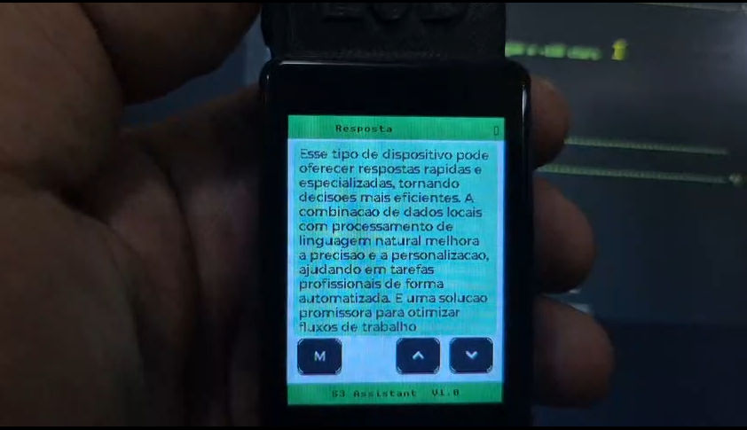

<div align="center">

# 🤖 ESP32 AI Assistant

### *Turn a microcontroller into an AI Assistant with Camera Vision — No Proprietary Cloud, No Monthly Subscription, 100% Yours.*

[](LICENSE)
[](mailto:mrclnndrd@gmail.com)
[](https://github.com/espressif/esp-idf)
[-purple.svg)]()
[]()
[]()

---

> **"A portable AI assistant with a camera — and you can build one today."**


<video src="https://github.com/user-attachments/assets/cf833a62-3809-4c02-ae4d-6812c46d103d" controls width="720">
  <a href="https://github.com/user-attachments/assets/cf833a62-3809-4c02-ae4d-6812c46d103d">▶ Watch video demo</a>
</video>

</div>

---

## 🚀 "Expert-on-Device" Platform: Data Sovereignty and Strategic Differentiators

More than a simple "AI assistant", this is a **multimodal, configurable, and sovereign platform for professional applications**, designed for scale deployment and multiple monetization models.

- **🤖 LLM Agnostic & Edge Computing**: Swap models (OpenAI, Claude, Groq) dynamically via Web Portal or run an *On-Premise* LLM. Ensures **total privacy, data sovereignty** and no *vendor lock-in*.
- **💼 Expert Profiles (B2B)**: Deploy the behavior of "agronomists", "mechanics", or "tutors" on the same embedded hardware by simply changing the context. Creates high-value segmented product lines.
- **💸 Cost-Effective Hardware (< US$33)**: Based on ESP32-S3 (Lite) and P4 (Pro), ensuring extremely low CAPEX, enabling large-scale sales to industrial fleets, schools, and hospitals.
- **👁️ Multimodality + Local Auditing**: Combines voice and camera interaction in real time, while automated native logs on the SD Card handle institutional *compliance*.
- **🧩 Ecosystem and Licensing**: Modular firmware ready for OEM agreements. Enables recurring revenue by selling "expert profiles as a service" far beyond simple hardware sales.

---

## 🎯 Comparison with Market Solutions

| | ✅ ESP32 AI Assistant | ❌ Typical Solutions |
|---|---|---|
| 💰 Hardware cost | **US$20 (S3)** or US$33 (P4-EYE) | US$200 to US$2,000+ |
| 🌐 Own server | **Optional (supports on-premise)** | Required |
| 🤖 AI Model | **Provider-agnostic (supports cloud or own LLM)** | Locked to 1 vendor |
| 📷 Computer Vision | **Yes — in the P4 Pro version** | Limited or cloud-dependent |
| 🎙️ Voice Processing | **Real-time, edge** | Cloud required |
| 🔐 **Data Privacy** | **Local processing (on-premise)** | Data on third-party servers |
| 🔋 Power consumption | **Ultra low (S3 Lite)** | High |
| 👕 **Wearable** | **✅ S3 Lite version** is optimized for this | ❌ Rare / dependent on proprietary ecosystem |
| 📦 Size | **Smaller than a deck of cards** | Desktop or server |

---

## 🔓 Open Architecture — LLM Agnostic

> **Current status:** The **ESP32-S3 Lite** firmware is now the **most advanced** in the project, being 100% dynamically LLM-agnostic — you can switch providers (OpenAI, Anthropic, Groq, Ollama) via Web without recompiling! The ESP32-P4 Pro version follows the same standard of excellence.

The firmware architecture was designed to support any provider via REST API. When implemented, you simply edit `settings.json`:

```json
{
  "ai": {
    "base_url": "https://api.anthropic.com/v1",
    "model":    "claude-3-5-sonnet",
    "token":    "sk-ant-...",
    "personality": "You are a technical specialist..."
  }
}
```

| Provider | Planned base_url | Target Models | Differentiator |
|---|---|---|---|
| **OpenAI** *(current)* | `api.openai.com/v1` | `gpt-4o`, `gpt-4o-mini` | Current project standard |
| **Anthropic** | `api.anthropic.com/v1` | `claude-3-5-sonnet` | Superior technical reasoning |
| **Groq** | `api.groq.com/openai/v1` | `llama-3-70b`, `mixtral` | Ultra-low latency |
| **OpenRouter** | `openrouter.ai/api/v1` | All of the above | One key for all |
| **Local (Ollama)** | `local-ip:11434/v1` | Llama 3, Mistral | Full offline privacy |

> 💡 **For enterprises:** With this feature implemented, it is perfectly feasible to point the ESP32-P4's `base_url` to an internal LLM server on the local network (e.g., Ollama) via the Web Portal, keeping audio and images under offline sovereignty without leaking data to the public internet!

> 🧠 **Multiple Profiles and Personalities:** All behavioral instructions filled in the Web Captive Portal will be combined with the physical expert profile rotated on the board, creating much more singular and unique agents. This data will be persistently saved on the MicroSD card via `settings.json`.

---

## 📱 Two versions, one ecosystem

<div align="center">

### 🟢 ESP32-S3 — The LITE version

<video src="https://github.com/user-attachments/assets/b09528aa-6595-4580-8ac2-b57701bd5fd9" controls width="100%" style="max-width: 720px;">
  <a href="https://github.com/user-attachments/assets/b09528aa-6595-4580-8ac2-b57701bd5fd9">▶ Watch S3 video demo</a>
</video>

> *Cutting-edge firmware: Fluid response, Deep Sleep, and intelligent RMS filtering.*

|  |  |  |
|---|---|---|

</div>
 
**Hardware:** ESP32-S3 kits (e.g., ESP32-S3-Touch-LCD) starting at **~US$20**
 
- 🔋 **Optimized Battery**: Native Deep Sleep (< µA), lasts for days. Instant Wake-on-Button.
- 🎙️ **Refined Processing**: Advanced firmware with RMS audio filtering configurable via Web.
- ⚙️ **Captive Portal**: Configures Wi-Fi, AI, and Audio Threshold (VAD) dynamically.
- ⚡ **High Robustness**: Asynchronous management with `FreeRTOS Queues` and optimized use of 8MB `PSRAM`.
- 💾 **Local Persistence**: Records WAVs and chat logs to SD Card (Opportunistic Saving).
- 👕 **Ultra Portable**: Ideal for pocket assistants, wearables, or smart badges.

> 🌐 **Intuitive Configuration**: The Captive Portal allows adjusting the Audio Threshold (RMS) and AI credentials without cables.
> 
 
---
 
<div align="center">

### 🔵 ESP32-P4-EYE — The PRO version

|  |  |  |
|---|---|---|

</div>
 
**Hardware:** ESP32-P4 + OV2710 (2MP) + MIPI-DSI Display + Wi-Fi C6 Co-processor
 
- 📷 **Computer Vision**: 2MP camera with hardware ISP for automatic color and exposure.
- 🖥️ **MIPI Performance**: High-resolution display via DSI bus (fluid LVGL).
- 🌐 **Wi-Fi Sovereignty**: Connectivity via ESP32-C6 (ESP-Hosted) for maximum stability.
- 💾 **SDIO 4-Bit**: Massive high-speed storage for photos and videos.
- ⚙️ **Modularity**: Ideal for kiosks, fixed stations, or robots that require vision.
 
---
 
### Physical Version Comparison
 
| Feature | ESP32-S3 (Lite) | ESP32-P4-EYE (Pro) |
|---|---|---|
| **Focus** | **Portability / Battery** | **Vision / Performance** |
| **Integrated Camera** | ❌ | ✅ 2 Megapixels |
| **LVGL Interface** | ✅ ST7789 / SPI | ✅ High Performance / MIPI-DSI |
| **SD Storage** | ✅ Optimized / SPI | ✅ High Speed / SDIO 4-Bit |
| **Wi-Fi** | Native Internal STA | Via Auxiliary C6 (ESP-Hosted)|
| **Optimized Battery** | ✅ Native Deep Sleep (< µA) | ❌ |

---

##   Possible Real-World Use Cases (and where the money is)

```
🏭 Industry 4.0
   → Hands-free operator consults manuals by voice and component photo
   → ROI: eliminates ~2h/day downtimes for searching technical documentation

  Healthcare
   → Smart badge transcribes consultations directly into medical records
   → ROI: reduces ~40% of administrative filling time

🏗️ Construction
   → Identifies materials and quantifies by photo, generates reports by voice
   → ROI: accelerates inspections and surveys from hours to minutes

🌾 Agriculture
   → Field device identifies pests and diseases by plant photo
   → ROI: immediate diagnosis without waiting for a specialized technician

🔒 Corporate Security
   → Real-time scene analysis without sending images to public cloud
   → ROI: LGPD/GDPR compliance without giving up advanced AI

  Automotive / Logistics
   → Voice onboard assistant without screen, without cable, minimal consumption
   → ROI: hands-free for drivers with automated checklist

👕 Wearables & Consumer
   → Smart glasses, smartwatch, personal pocket assistant
   → ROI: US$186 billion market in wearable devices (2027)
```

---

## 🧠 Expert-on-Device — The Concept that Changes Everything

<div align="center">


</div>

**Expert-on-Device** is the core idea that differentiates this project from a simple "button that calls ChatGPT".

Instead of a generic assistant, the device **changes its behavior** according to the configured profile — like having a dedicated specialist for each use context:

| Profile | The device behaves like... | Usage Example |
|---|---|---|
| 🌾 **Agro** | Field agronomist | *"What are the best nutrients for tomatoes?"* — responds with dosage, timing, visual symptoms |
| 🎓 **Teacher** | Personalized tutor | *"Explain photosynthesis"* — adapts language to the student's level |
| 🗂️ **Meeting** | Executive secretary | *"Summarize what was decided"* — transcribes and synthesizes into bullet points |
| ⚙️ **Engineer** | Technical specialist | *"What is this component?"* (photo) — identifies and describes specifications |
| 🩺 **Health** | Clinical aide | *"Record: patient reports pain for 3 days"* — formats for medical records |
| 🔧 **General** | All-purpose assistant | Everyday use without specific context |

### Why is this revolutionary?

> Today, a doctor pays US$500/month for a transcription app. An agronomist flies for hours to give a field diagnosis. An engineer opens 800-page manuals to identify a failure.
>
> **With US$33 of hardware and this firmware, any professional carries the specialist in their pocket — no platform subscription, no cameras sending images to third-party servers.**

### How profiles work technically

Profiles are **system prompts** stored in the `settings.json` on the SD card, loaded at startup. Switching profiles = editing the `ai.personality` field and restarting — **no firmware recompilation needed**.

```json
{
  "ai": {
    "personality": "You are an agronomist specialized in tropical horticulture..."
  }
}
```

Want a fully customized profile for your business? Just edit `settings.json` — or configure it via the Captive Portal directly in the field.

---

## 🚀 The Firmware as a Portable "Brain"

The project's modular architecture allows the same logic — media capture, AI orchestration, and profile management — to be embedded in different form factors:

- **👓 Smart Glasses** — Embedded ESP32-S3 processes what the user sees in real time, responding via audio. Ideal for the Engineer profile in hands-free industrial maintenance.
- **⌚ Smartwatch / Wearables** — The low power consumption and small size of the S3 enable wearable devices for health or security, with Edge AI directly on the wrist.
- **⛑️ Smart Helmets and PPE** — The "Expert" profile integrated into a construction helmet can identify hazards by photo and alert the worker via local audio, without depending on a network.

> The hardware changes. The firmware stays the same.

---

## ⚡ Quick Start (5 minutes)

### Prerequisites
- [ESP-IDF v5.5.1](https://docs.espressif.com/projects/esp-idf/en/stable/esp32p4/get-started/)
- Hardware: **ESP32-P4-EYE** or any **ESP32-S3** board with microphone
- Account with any AI provider with REST API (OpenAI, Anthropic, Groq...)

| Hardware | Where to buy | Price (reference) |
|---|---|---|
| **ESP32-S3 Lite** with mic | [AliExpress](https://aliexpress.com) | **~US$20–35** |
| **ESP32-P4-EYE Pro** | [DigiKey](https://www.digikey.com/en/products/detail/espressif-systems/ESP32-P4-EYE/26648584) | **~US$33** |
| **ESP32-S3-BOX-3** (Espressif) | [DigiKey](https://www.digikey.com) / [Mouser](https://mouser.com) | **~US$40** (display + mic + speaker included) |
| INMP441 Microphone (S3 add-on) | [AliExpress](https://aliexpress.com) | **~US$2–5** |

### 1. Clone and configure
```bash
git clone https://github.com/marcelinoandrade/assistente-de-IA.git
cd assistente-de-IA

# Copy the credentials template
cp firmware/esp32_p4_firmware/components/bsp/include/secret.h.example \
   firmware/esp32_p4_firmware/components/bsp/include/secret.h

# Edit secret.h with your editor and fill in:
# SECRET_WIFI_SSID, SECRET_WIFI_PASS, SECRET_OPENAI_API_KEY
```

### 2. Build and flash (P4)
```bash
cd firmware/esp32_p4_firmware

# Windows
. ..\..\..\..\activate_esp_idf.ps1

# Linux/Mac
. $HOME/esp/esp-idf/export.sh

idf.py -p COM12 build flash monitor   # Windows
idf.py -p /dev/ttyUSB0 build flash monitor  # Linux
```

### 3. ⚙️ Zero-Touch Configuration (Captive Portal)
> No need to recompile! Perfect for field deployment.

1. **Hold BTN2 + BTN3 for 10 seconds**
2. Connect to the `Assistant-Config-P4` Wi-Fi (no password)
3. Open the browser at `http://192.168.4.1`
4. Fill in SSID, Password, and Token — the device restarts automatically

### 4. How to use
```
🟢 Voice Mode (default)
   → Hold the ENCODER → Speak → Release → Wait for response

📷 Photo+Voice Mode
   → Turn the KNOB to select "Photo+Voice" mode
   → Press BTN1 to capture a photo
   → Hold ENCODER → Ask your question about the photo → Release
```

---

## 🗂️ What is saved on the SD Card

```
/sdcard/
├── media/
│   ├── images/   → IMG_20260222_143052.jpg  (captured photos)
│   └── audio/    → REC_20260222_143052.wav  (recorded audio)
├── logs/
│   └── chat/     → CHAT_20260222.txt        (daily conversation log)
└── data/
    └── settings.json                         (your settings)
```

---

## 🏗️ Architecture

```
┌──────────────────────────────────────────────────────────┐
│                    ESP32-P4 (Host)                       │
│                                                          │
│  ┌──────────────┐  ┌──────────┐  ┌──────────────────┐  │
│  │    app.c     │  │  gui.c   │  │     bsp.c        │  │
│  │  Logic +     │  │  LVGL +  │  │  Camera ISP +    │  │
│  │  2 Modes     │  │  Scroll  │  │  Audio PDM +     │  │
│  └──────┬───────┘  └──────────┘  │  SD + Wi-Fi      │  │
│         │                        └─────────┬────────┘  │
│  ┌──────▼───────────────┐                  │           │
│  │    app_storage.c     │        ┌──────────▼───────┐  │
│  │  config_manager.c    │        │   ESP32-C6       │  │
│  │  captive_portal.c    │        │  Wi-Fi Remote    │  │
│  │                      │        │  SDIO 4-bit      │  │
│  └──────────────────────┘        └──────────┬───────┘  │
│          │                                  │           │
│      SD Card                             Internet       │
│   (photos/audio/logs)                       │           │
└─────────────────────────────────────────────┼───────────┘
                                              │
                               ┌──────────────▼──────────────┐
                               │    Any LLM via API          │
                               │  OpenAI • Claude • Groq     │
                               │  Llama • Gemini • Ollama    │
                               └─────────────────────────────┘
```

**Value Flow:**
```
User → [Voice + Optional Photo]
     → ESP32 captures and processes
     → Sends to the LLM of your choice
     → Receives text response
     → Displays on screen + saves to SD
     → User obtains actionable insights ✅
```

---

## 📈 Performance and Stability (Real Logs)

> No made-up benchmarks. These are numbers measured on real hardware.

| Metric | Measured Value |
|---|---|
| ⏱️ Full boot (all peripherals) | **~10 seconds** |
| 🧠 Available PSRAM | **32 MB** (AP HEX PSRAM, 80MHz) |
| 🎙️ Audio chunk | 3,840 bytes / 120ms (16kHz, 16-bit) |
| 📷 Captured JPEG | 14–15 KB (240×240px, validated) |
| 💾 WAV recording to SD | **< 300ms** after AI response |
| 🔧 Captive Portal activation | **~2.5 seconds** |
| 🔋 DHCP for AP client | **~200ms** (IP 192.168.4.2 confirmed) |
| 🌐 End-to-end latency (voice→response→save) | **~5–8 seconds** |

👉 **[See full log analysis for ESP32-S3 Lite →](docs/log_tecnico_s3.md)**  
👉 **[See full log analysis for ESP32-P4-EYE Pro →](docs/log_tecnico_p4.md)**

---

## 📋 Features

- [x] **Robust Push-to-Talk**: Starts on hardware falling edge and ends on rising edge deterministically. The last AI response actively persists on the display for the user.
- [x] **Voice** mode (audio only) and **Photo+Voice** mode (camera + audio simultaneously).
- [x] **Dynamic Base URL and Model**: Switch LLM providers via Captive Portal without plugging cables or recompiling firmware.
- [x] **Combined Expert Mode**: Integrate custom personalities via SD Card with hardware-selectable profiles.
- [x] **Zero-Touch Captive Portal**: Quick Wi-Fi, AI Token, Model, and System Prompt configuration via Web Browser.
- [x] **Event-Driven Architecture & Advanced PSRAM**: Intensive use of isolated Tasks (`FreeRTOS`), Mutex on SPI bus to protect local logging from GUI/SD slowdowns, and secure offline saving system (`Opportunistic Saving`).
- [x] **Conversation History (Multi-turn)**: PSRAM retains dynamic options in the "context window". The device remembers what you reported moments before.
- [x] Robust SD Card: Saves photos (`IMG_*.jpg`), PCM audio converted to perfect WAV (`REC_*.wav`), and interaction transcripts (`CHAT_*.txt`).
- [x] SNTP with internal clock (Exact timestamp for all SD records).
- [x] Long File Names in FATFS.
- [x] Responsive LVGL interface and Intelligent Battery Management via optimized **Deep Sleep** (Microamp standby timer and button Wakeup).
- [x] Integrated DNS server in AP-Mode for immediate Web Portal pop-up.
- [ ] Locally integrated offline TTS (Text-to-Speech) — *planned*
- [ ] Native local wake word (replacing continuous physical button use) — *planned*
- [ ] Optional Companion Apps and BLE Platforms — *planned*
- [ ] **OTA (Over-The-Air)** — Updating the embedded system and custom models wirelessly, via Cloud — *planned*

---

## 📄 License

### 🆓 Non-Commercial Use — FREE forever

For **personal, educational, academic research, and open-source projects**:

**[Creative Commons Attribution-NonCommercial-ShareAlike 4.0 (CC BY-NC-SA 4.0)](LICENSE)**

✅ You can use, modify, and distribute freely  
✅ Research, theses, personal prototypes, makers  
✅ Schools, universities, communities  
📌 Requires attribution to the original project  
📌 Modifications must use the same license  

---

### 💼 Commercial Use — License Required

For **products for sale, SaaS, OEM, corporate integration, or resale**:

| Type | For whom | Price |
|---|---|---|
| 🏠 **Individual / Startup** | Own product, up to 100 units | *Contact us* |
| 🏢 **Company / OEM** | Integration into commercial product | *Contact us* |
| 🏭 **Enterprise** | Volume, SLA, dedicated support | *Contact us* |

> **📧 [Request Commercial License](mailto:mrclnndrd@gmail.com)**
> 
> Includes: use in closed product, no attribution obligation, priority support.

**Examples of uses that require a license:**
- Physical product with this firmware for sale
- Paid service (SaaS, subscription) based on this system  
- Customization for clients for payment
- Integration into corporate or industrial solutions

---

## 🌟 Community & Showcase

**Built something with this project?** Open an [Issue with the `showcase` tag](../../issues) and show it to the world!

Community projects will appear here and on the project's social media.

---

## 🤝 Contributing

```bash
# Fork → Clone → Branch → Code → PR
git checkout -b feature/local-wake-word
git commit -m "feat: add offline wake word detection"
git push origin feature/local-wake-word
# Open a Pull Request!
```

Areas where contributions are especially welcome:
- 🤖 **Validate providers and test Multimodal model compatibility** (Anthropic Claude, Groq Whisper) and fix response parsing in C language if needed
- 🔗 **Bring Pro (Vision) functionality to the ESP32-S3** (feature currently available for ESP32-P4)
- 📡 **OTA (Over-The-Air)**: firmware update over Wi-Fi — no USB cable needed in the field
- 🔊 TTS (local voice synthesis)
- 📱 Companion app (BLE/Wi-Fi)
- 🌍 README translations

---

## ⭐ If this project impressed you, leave a star and share!

> *Every star helps this project reach more makers, researchers, and companies that can benefit from accessible embedded AI.*

---

<div align="center">

**🇧🇷 Made in Brazil | ESP32 AI Assistant**

[⭐ Star](../../stargazers) · [🐛 Issues](../../issues) · [💼 Commercial License](mailto:mrclnndrd@gmail.com) · [🤝 Contribute](../../pulls)

</div>
