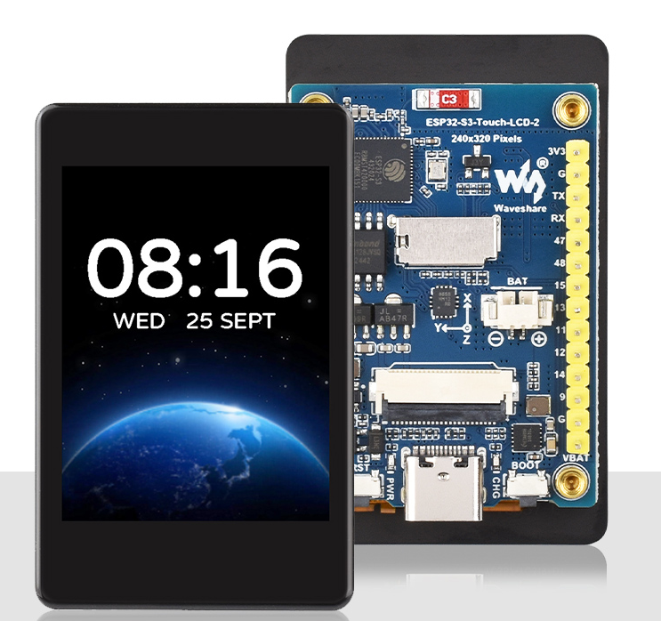
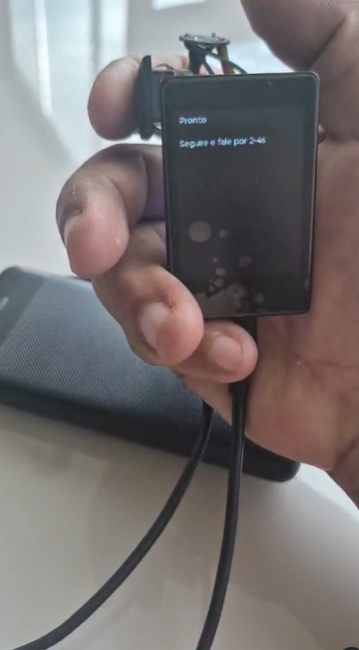
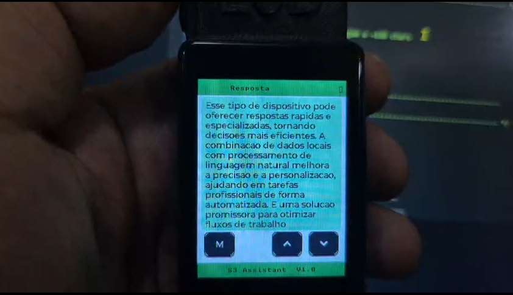
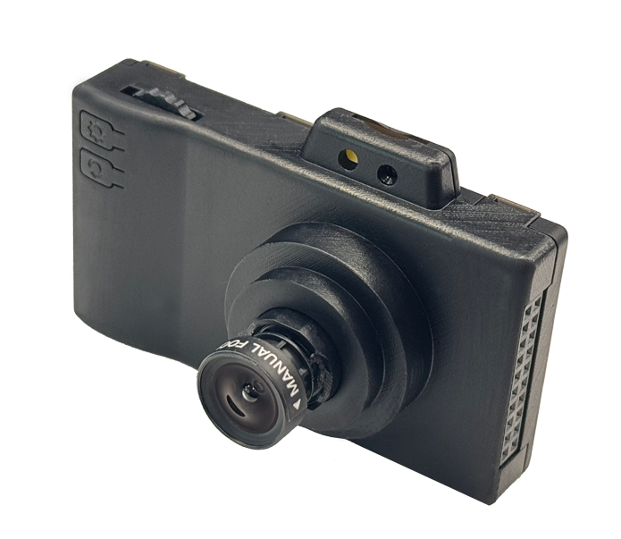
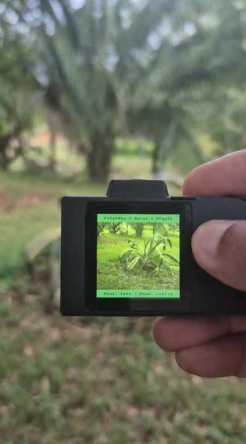
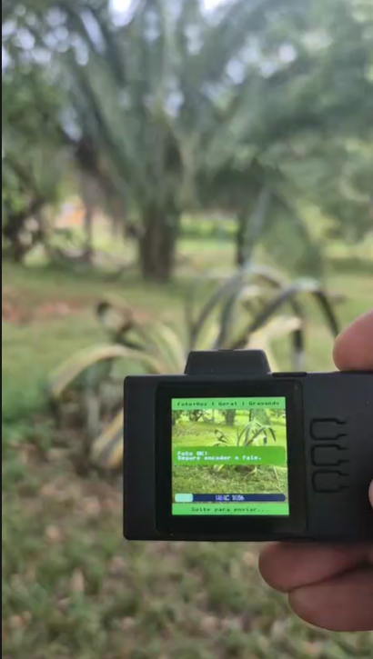

<div align="center">

# ExpertOnDevice-AI

### A microcontroller that captures voice (and, on the P4, a photo), applies a specialist profile, and asks an LLM. The model is not on the chip.

[](LICENSE)
[](mailto:mrclnndrd@gmail.com)
[](https://github.com/espressif/esp-idf)
[]()
[]()
[]()

<video src="https://github.com/user-attachments/assets/cf833a62-3809-4c02-ae4d-6812c46d103d" controls width="720">
  <a href="https://github.com/user-attachments/assets/cf833a62-3809-4c02-ae4d-6812c46d103d">Watch demo</a>
</video>

</div>

This is **edge orchestration**, not an on-device LLM. The ESP32 holds the microphone, display, battery policy, SD audit trail, and the expert persona. Inference runs on whatever OpenAI-compatible endpoint you put in the Captive Portal — a public API today, or a machine on your LAN tomorrow. No firmware rewrite either way.

It exists for places where a phone is the wrong tool: dirty hands, factory floors, field work, objects that should answer as themselves. It is not a consumer AI pin, and it does not replace ChatGPT in your pocket.

The four pillars are in the [Manifesto](Manifesto.md). Short version: **sovereignty is optional (gateway on your network), auditing is native (SD card), the brain is swappable, the persona lives on the device.**

---

## Two kits, one idea

| | **S3 Lite** — pocket / battery | **P4-EYE Pro** — vision / desk |
|---|---|---|
| SoC | ESP32-S3 + 8 MB PSRAM | ESP32-P4 + 32 MB PSRAM, Wi-Fi via C6 |
| Camera | No (external module if you add one) | Yes — OV2710 2 MP |
| Display | ST7789 SPI + touch | MIPI-DSI + LVGL |
| Storage | MicroSD over SPI | MicroSD over SDIO 4-bit |
| Sleep | Deep sleep, wake on button | Not the point of this SKU |
| Typical kit | ~US$20–35 | ~US$33 |

<div align="center">

|  |  |  |
|---|---|---|

<video src="https://github.com/user-attachments/assets/edd8e80d-49d6-43e2-8205-6af94bb31002" controls width="100%" style="max-width: 720px;">
  <a href="https://github.com/user-attachments/assets/edd8e80d-49d6-43e2-8205-6af94bb31002">S3 demo</a>
</video>

|  |  |  |
|---|---|---|

</div>

S3 is the wearable-shaped device: push-to-talk, 8 kHz capture, high-pass filter, opportunistic WAV/chat save, then deep sleep. P4 is the vision SKU: voice + photo. Same product idea; two board support packages. The C trees are still separate — do not assume every S3 feature is already on the P4, or the reverse.

---

## What you configure in the field

Hold the record button + profile control for ~10 s (S3) or BTN2 + BTN3 (P4). Join `Assistant-Config-S3` / `Assistant-Config-P4` (no password). Open [http://192.168.4.1](http://192.168.4.1). Wi-Fi, token, URL, model, personality, and up to six specialist profiles are written to `/sdcard/data/config.txt`. The device reboots. No USB, no recompile.


Leave the token empty to drop the `Authorization` header (Ollama, vLLM, a local gateway).

### Models — what actually ran on hardware

The wire format is OpenAI Chat Completions with `input_audio` (WAV in base64) and SSE streaming. Preview names die; the portal is how you survive that.

| Model | Status |
|---|---|
| `gpt-audio-mini` | Tested on S3 (Aug 2026). Current default to put in the portal. |
| `gpt-audio-1.5` | Same family; use if you want the larger audio model. |
| `gpt-4o-mini-audio-preview` / `gpt-4o-audio-preview` | **Retired by OpenAI (May 2026).** A device still holding these names gets HTTP 404. Change the model in the portal. |
| Groq, Ollama, LiteLLM, anything `/v1/chat/completions` | Compatible on paper. **Not validated on this hardware yet.** Open an issue with the `provider-test` tag if you try. |

Cloud is Architecture A (default). Architecture B is your own gateway: same POST from the ESP32, Whisper + LLM on your network, OpenAI-shaped SSE back. Firmware unchanged; you only edit the URL. Local inference is not free — it costs your GPU and your time — but the audio never has to leave the building.

---

## Expert-on-Device

The device is not a generic chatbot. A **profile** is a system prompt on the SD card (agronomist, tutor, engineer, a UnB digital-electronics lab assistant, …). The Captive Portal screenshot above is a real config: four profiles, Portuguese personality, `gpt-audio-mini`.

That is what ships today.

The longer idea — a treadmill that *is* a biomechanics coach, a helmet that *is* a safety engineer — is OEM: this firmware plus **the object’s own sensors**. This repository does not include a speed encoder or a heel-pressure insole. The persona mechanism is here; the rest of the machine is the customer’s.

Where this is a better tool than a phone: factory floor, field agriculture, inspection, embedding inside a product. Where it is not: competing with the smartphone you already carry, or claiming a US$186B wearable TAM.

---

## Quick start

Needs [ESP-IDF v5.5.1](https://docs.espressif.com/projects/esp-idf/en/v5.5.1/esp32s3/get-started/index.html). An older IDF on the PATH will still *monitor* a board that was flashed with 5.5.1; do not re-flash from a mismatched tree if you want the binary you already validated.

```bash
git clone git@github.com:marcelinoandrade/ExpertOnDevice-AI.git
cd ExpertOnDevice-AI
. $HOME/esp/esp-idf/export.sh

# S3 Lite (native USB usually /dev/ttyACM0 on Linux, COMx on Windows)
cd firmware/esp32_s3_firmware
idf.py -p /dev/ttyACM0 build flash monitor

# P4-EYE
# cd firmware/esp32_p4_firmware
# cp components/bsp/include/secret.h.example components/bsp/include/secret.h
# idf.py -p /dev/ttyUSB0 build flash monitor
```

`secret.h` is only a compile-time fallback. After first boot, the Captive Portal owns Wi-Fi, token, URL, and model.

**Use:** hold the encoder / record button, speak, release, wait. On the P4, Photo+Voice is a second mode (knob + capture, then hold to ask about the picture).

**SD layout:** `/sdcard/media/audio/*.wav`, `/sdcard/media/images/*.jpg`, `/sdcard/logs/chat/*.txt`, `/sdcard/data/config.txt`.

---

## What we measured (not a datasheet)

From serial logs on real boards — [S3 log](docs/log_tecnico_s3.md) (Mar 2026, 8 kHz) and [P4 log](docs/log_tecnico_p4.md). Different chips; do not mix the rows.

| | ESP32-S3 Lite | ESP32-P4-EYE |
|---|---|---|
| Ready (`app_main` / full bring-up) | ~1.5 s to app start; Wi-Fi IP ~3 s from power-on | ~10 s all peripherals |
| PSRAM | 8 MB octal, 80 MHz | 32 MB |
| Capture | 8 kHz, 16-bit mono, 100 ms windows | 16 kHz, 16-bit, 120 ms chunks |
| Voice → text on screen | ~4–8 s after release (network + API) | ~5–8 s end-to-end including save |
| Deep sleep current | Estimated; lab figure not published. Backlight is held LOW. | Not the design goal |

The S3 path: I2S → PSRAM PCM → 100 Hz high-pass → WAV/base64 → HTTPS SSE → LVGL. HTTP client is kept alive across turns. SD writes wait until the radio is idle.

---

## Honest backlog

Done: push-to-talk, Captive Portal, SD audit trail, multi-turn history in PSRAM, SNTP timestamps, S3 deep sleep, P4 camera mode.

Not done: on-chip TTS, wake-word, OTA, BLE companion, a shared `app/` between S3 and P4, encrypted tokens on the SD card. The P4 audio path still has a hardcoded preview-model fallback in C — set the model in the portal anyway.

---

## License

**Non-commercial** (personal, school, research): [CC BY-NC-SA 4.0](LICENSE) — use, fork, attribute, share alike.

**Commercial** (product for sale, OEM, SaaS, paid integration): separate license — [mrclnndrd@gmail.com](mailto:mrclnndrd@gmail.com). The business is the firmware and the profiles, not a US$25 board with a 4-dollar margin.

---

## Contributing

Useful PRs: validate a non-OpenAI provider (`provider-test` issue with URL, model, HTTP status), OTA, shared S3/P4 core, local TTS, S3 camera. Showcase builds: open an issue tagged `showcase`.

```bash
# Ollama (untested here) — token empty in the portal
ollama serve
# URL: http://<pc>:11434/v1/chat/completions
```

<div align="center">

**Made in Brazil** · [Star](../../stargazers) · [Issues](../../issues) · [Commercial license](mailto:mrclnndrd@gmail.com)

</div>
